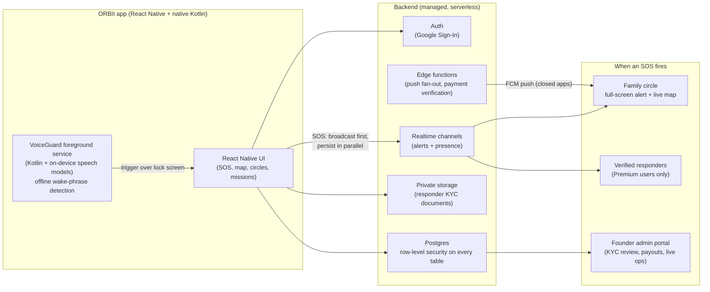

#  ORBII

### Your safety. Always with you.

**A women's safety platform for India: hands-free Voice SOS that works on a locked phone, offline. Live location to your family circle. Verified responders nearby.**

[Website](https://orbii.in).

[Download APK](https://orbii.in/#download) ·

[Privacy Policy](https://orbii.in/privacy-policy)

> 🔒 This is the public showcase of ORBII. The application source code is proprietary and lives in a private repository. This repo documents what ORBII is, how it works, and how it is built.

---

## The problem

When a woman is in danger in India, she usually cannot open an app, unlock a phone, or type a message. Existing SOS apps assume she can. ORBII assumes she can only do one thing: **shout**.

## What ORBII does

| | Feature | How it works |
|---|---|---|
| 🎙️ | **Voice SOS, fully offline** | She says her distress phrase ("help help", "bachao", or a custom secret phrase) and the SOS fires, even with the phone **locked**, even with **no internet**. Speech recognition runs entirely on the device with bundled English + Hindi models. Audio never leaves the phone. |
| 📍 | **Instant circle alerts** | Her live location streams to her family circle in under a second over a realtime channel, with push notifications reaching phones whose app is closed. |
| 🧑‍🤝‍🧑 | **Verified responders (Premium)** | KYC-verified helpers nearby are dispatched to Premium users. Every responder uploads government ID and a selfie, and is manually reviewed and approved before they can ever go online. |
| 🚨 | **5-second cancellable countdown** | Accidental triggers cost nothing. Real ones dispatch alerts, start incident audio recording, and open a live response map. |
| 🚶 | **Safe Journey** | Share a trip with your circle; going silent or off-route escalates automatically. |
| 👑 | **Guardian recognition** | Responders earn trust scores, Bronze → Elite guardian levels, and rewards, not per-rescue bounties (which attract the wrong people). |

## Architecture

**Design rule: alert people first, save the record second.** The realtime broadcast fires in well under a second; the database write happens in parallel so a slow network never delays help.

## Engineering highlights

- **Offline speech on a locked phone.** A native Android foreground service runs bundled speech models on-device. No speech API, no per-use cost, no audio upload. Includes voice-activity gating for battery, smart auto-gain for muffled audio (pocket, purse), strict whole-word matching to prevent false triggers, and cross-utterance repeat detection so a panicked "help ... help" with a pause still fires.
- **Privacy enforced by the database, not the UI.** Every table carries row-level security: users can only read their own data. A victim's live location is served only to people near her, only during an active emergency, and free-tier users' locations are never visible to strangers at all.
- **Tiered dispatch.** Free users' SOS reaches their own circle only. Premium unlocks the verified-responder network. The gate is enforced in three independent layers (realtime, query, and client), so it cannot be bypassed.
- **KYC without a KYC budget.** Responders upload ID documents from the gallery into a private bucket readable only by them and the founder's admin session. Manual review, one-click approve, database-blocked self-promotion (a user cannot make themselves a responder even with API access).
- **A real operations portal** at a private URL: live user/revenue/SOS stats, application review with document viewing, earnings ledger and payout management, all locked to the founder's account server-side.
- **Cost engineering.** Maps (open vector tiles), speech (on-device), auth (OAuth), push (FCM): every traditionally expensive component chosen deliberately so infrastructure cost stays near zero deep into five figures of users.

## Screenshots

<!-- Drop device screenshots into /screenshots and update these paths. -->

| Onboarding | Home | SOS countdown | Live response map |
|---|---|---|---|
|  |  |  |  |

## Tech stack

`React Native (Expo)` · `TypeScript` · `Kotlin` (voice foreground service) · `On-device speech recognition (EN + HI, bundled)` · `Postgres + row-level security` · `Realtime channels` · `Serverless edge functions` · `MapLibre + open vector tiles` · `FCM push` · `Astro` (website + admin portal)

## Status & roadmap

- TESTING V2.2.002

## Author

Built by **Jatin **, founder of ORBII.

📫 jaykumar2470f@gmail.com · 🌐 [orbii.in](https://orbii.in)

---

© 2026 ORBII. All rights reserved. This repository contains documentation only; the ORBII source code, models configuration, and infrastructure are proprietary.
