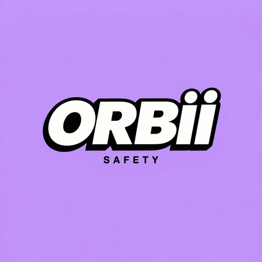

#  ORBII

### Your safety. Always with you.

**A women's safety platform for India: hands-free Voice SOS that works on a locked phone, offline. Live location to your family circle. Verified responders nearby.**

> *Help should arrive before panic does.*

The only app in India that combines a **hands-free voice trigger**, an **offline mesh relay**, and a **verified human responder network**, and the only one building responder density campus by campus, on real dispatches rather than downloads.

| Step | Traditional Response | ORBII |
|------|----------------------|--------|
| Unlock phone | 5–10 sec | Not required (Voice SOS) |
| Open emergency app | 5–15 sec | Automatic |
| Call someone | 15–30 sec | Automatic |
| Share live location | Manual | Instant |
| Notify emergency contacts | One by one | All at once |
| Start evidence recording | Manual | Automatic |
| Nearby helpers alerted | Usually unavailable | Instant (when available) |
| Total time to start response | 30–60+ sec | 1–3 sec |

[Website](https://orbii.in).

[Download APK](https://orbii.in/#download) ·

[Privacy Policy](https://orbii.in/privacy-policy)

[FEATURES](https://www.orbii.in/features)

> 🔒 This is the public showcase of ORBII. The application source code is proprietary and lives in a private repository. This repo documents what ORBII is, how it works, and how it is built.

---

## The problem

When a woman is in danger in India, she usually cannot open an app, unlock a phone, or type a message. Existing SOS apps assume she can. ORBII assumes she can only do one thing: **shout**.

## What ORBII does

| | Feature | How it works |
|---|---|---|
|  | **Voice SOS, fully offline** | She says her distress phrase ("help help", "bachao", "madad") and the SOS fires, even with the phone **locked**, even with **no internet**. Speech recognition runs entirely on the device with bundled English + Hindi models. Audio never leaves the phone. |
|  | **Offline mesh relay** | No signal at all? The alert hops phone to phone over encrypted Bluetooth to any ORBII nearby, until it reaches one that still has a connection. A relaying phone carries the SOS but can never read it. (Built, in field testing.) |
|  | **Instant circle alerts** | Her live location streams to her family circle in under a second over a realtime channel, with push notifications reaching phones whose app is closed. |
|  | **Circle map + geofencing** | See the people you chose on a live map, and see exactly who can see you. Draw a safe zone: if someone you love leaves it, your circle is told, with the time and the place. Consent-first, the fenced person is notified and can decline. |
|  | **Verified responders (Premium)** | KYC-verified helpers nearby are dispatched to Premium users, matched by proximity, trust and reliability, with automatic no-show recovery that reassigns a backup. Every responder uploads government ID and a selfie, and is manually reviewed and approved before they can ever go online. |
|  | **5-second cancellable countdown** | Accidental triggers cost nothing. Real ones dispatch alerts, start incident audio recording (including the seconds before she spoke), and open a live response map. |
|  | **Safe Journey** | Share a trip with your circle; going silent or off-route escalates automatically. |
|  | **Guardian recognition** | Responders earn trust scores, Bronze → Elite guardian levels, and rewards, not per-rescue bounties (which attract the wrong people). |

## Performance targets

Measured in our own testing, not independently audited yet.

| Metric | Target |
|---|---|
| Offline trigger detection | < 300 ms |
| Average time to start a response | ~ 1.3 s |
| Supported languages | 3 (English, Hindi, custom phrase) |
| Background battery drain | < 1.5% per hour |

## Architecture

**Design rule: alert people first, save the record second.** The realtime broadcast fires in well under a second; the database write happens in parallel so a slow network never delays help.

## Engineering highlights

- **Offline speech on a locked phone.** A native Android foreground service runs bundled speech models on-device. No speech API, no per-use cost, no audio upload. Includes voice-activity gating for battery, smart auto-gain for muffled audio (pocket, purse), strict whole-word matching to prevent false triggers, and cross-utterance repeat detection so a panicked "help ... help" with a pause still fires.
- **Survives phone-killers.** Aggressive OEM battery managers (Xiaomi, Realme, Oppo, Vivo) silently kill background apps. The listening service writes a heartbeat; if the OS kills it, ORBII detects the stale beat the next time you open the app, re-arms protection, and walks you through the exact per-device settings that keep it alive.
- **Offline mesh relay.** When there is no network at all, the SOS is sealed end to end and relayed phone to phone over Bluetooth, so an alert can escape even a full connectivity blackout.
- **Privacy enforced by the database, not the UI.** Every table carries row-level security: users can only read their own data. A victim's live location is served only to people near her, only during an active emergency, and free-tier users' locations are never visible to strangers at all.
- **Tiered dispatch.** Free users' SOS reaches their own circle only. Premium unlocks the verified-responder network. The gate is enforced in three independent layers (realtime, query, and client), so it cannot be bypassed.
- **A real operations portal** at a private URL: live user/revenue/SOS stats, application review with document viewing, earnings ledger and payout management, all locked to the founder's account server-side.
- **Cost engineering.** Maps (open vector tiles), speech (on-device), auth (OAuth), push (FCM): every traditionally expensive component chosen deliberately so infrastructure cost stays near zero deep into five figures of users.

## Tech stack

`React Native (Expo)` · `TypeScript` · `Kotlin` (voice + Bluetooth-mesh foreground services) · `On-device speech recognition (EN + HI, bundled)` · `Postgres + row-level security` · `Realtime channels` · `Serverless edge functions` · `PostGIS + pg_cron` · `MapLibre + open vector tiles` · `FCM push` · `Astro` (website + admin portal)

## Status & roadmap

- **Now:** Android (arm64), in closed testing and applied for Google Play production.
- **Live today:** hands-free Voice SOS (on-device, EN + HI), circle alerts, live map, geofencing, evidence recording.
- **In field testing:** the offline layer (SMS lifeline + Bluetooth mesh relay) and the verified-responder pilot.
- **Next:** a verified-responder pilot on campus (proving a real person actually comes), then a wider Android rollout. iOS is planned for a later version.

We say plainly what is proven and what is still in testing.

## Author

Built by **Jatin**, founder of ORBII, with **Vishnu** (on-device voice ML).

📫 jaykumar2470f@gmail.com · 🌐 [orbii.in](https://orbii.in)

━━━━━━━━━━━━━━━━━━━━━━

Built with ❤️ in India

If you find ORBII interesting,
consider starring the repository.

⭐

---

© 2026 ORBII. All rights reserved. This repository contains documentation only; the ORBII source code, models configuration, and infrastructure are proprietary.
